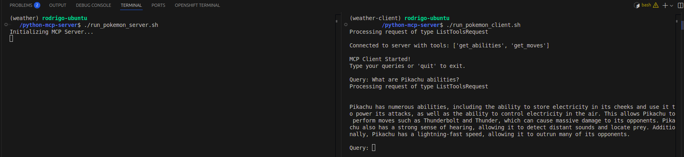

# Overview

This code is about two MCP Servers:
- The first one provides data from the National Weather Service (NWS).
- The second one provides data from Pokémon.

There's also two MCP Clients. Both of them use the Server's MCP tools to enhance the responses for User's questions (queries): 
- The first one connects to the NWS MCP Server which contains the Tools 'get_alerts' and 'get_forecast'.
- The second one connects to the Pokemon MCP Server which contains the Tools 'get_abilities' and 'get_moves'.

The Clients were built to integrate with both Amazon Bedrock and Claude LLMs APIs.

MCP Servers and their respective Clients were built following the [official MCP documentation](https://modelcontextprotocol.io/docs).



## Setup

1. [Install Python 3.10 or above](https://www.python.org/downloads/)
2. [Install Python MCP SDK 1.2.0 or above](https://pypi.org/project/mcp/)
3. [Optional] Install [uv](https://github.com/astral-sh/uv?tab=readme-ov-file#uv): ```curl -LsSf https://astral.sh/uv/install.sh | sh```

## How The MCP Servers Work:

Servers go up using FastMCP from the official [Python MCP SDK](https://pypi.org/project/mcp/)

The Servers use STDIO for Transport protocol.

Every Server expose MCP Tools using the annotation **@mcp.tool()** above their functions.

The Servers provide data based on 3rd-party APIs such as NWS and PokeAPI.

When the MCP Client LLM connects to the MCP Server those Tools are provided to help it to improve their research to answer questions (queries).


## How The MCP Clients Work:

When you submit a query:

1. The client gets the list of available tools from the server
2. Your query is sent to the LLM along with tool descriptions
3. The LLM decides which tools (if any) to use
4. The client executes any requested tool calls through the server
5. Results are sent back to the LLM
6. The LLM provides a natural language response
7. The response is displayed to you
​
## Best practices

### Error Handling

- Always wrap tool calls in try-catch blocks
- Provide meaningful error messages
- Gracefully handle connection issues

### Resource Management

- Use AsyncExitStack for proper cleanup
- Close connections when done
- Handle server disconnections

### Security

- Store API keys securely in .env
- Validate server responses
- Be cautious with tool permissions
- Prompt for user confirmation on sensitive operations

#### Clients SHOULD

- Show tool inputs to the user before calling the server, to avoid malicious or accidental data exfiltration
- Validate tool results before passing to LLM
- Implement timeouts for tool calls
- Log tool usage for audit purposes

### Tool Names
- Tool names can be validated according to the __format specified below__:
    - Tool names SHOULD be between 1 and 128 characters in length (inclusive).
    - Tool names SHOULD be considered case-sensitive.
    - The following SHOULD be the only allowed characters: uppercase and lowercase ASCII letters (A-Z, a-z), digits (0-9), underscore (_), dash (-), and dot (.)
    - Tool names SHOULD NOT contain spaces, commas, or other special characters.
    - Tool names SHOULD be unique within a server.
    - Example valid tool names: ```getUser ; DATA_EXPORT_v2 ; admin.tools.list```
- If a tool name conforms to the specified format, it should not fail validation by an MCP client